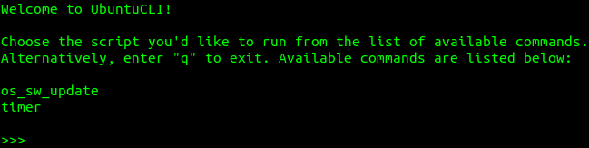

# UbuntuCLI


## Table of Contents
- [Introduction](#introduction)
- [Sample-screenshots](#sample-screenshots)
- [System-wide dependencies list](#system-wide-dependencies-list)
- [Installation](#installation)
    * [System-wide dependencies](#system-wide-dependencies)
    * [Repository import](#repository-import)
    * [Poetry initialization](#poetry-initialization)
- [Script descriptions](#script-descriptions)
    * [timer](#timer)
    * [os_sw_update](#os_sw_update)
- [How to run](#how-to-run)


## Introduction

At the time of this repository creation, Ubuntu is my primary OS. 

I also like using CLI, as well as automating my workflow with Python and bash. 

This results in creating various scripts that use Ubuntu Terminal as the 
primary interface.

UbuntuCLI is the collection of such scripts that can be used in a centralized 
manner.


## Sample screenshots
<div align=center margin=auto> 
  
  <p>UbuntuCLI initial greeting</p>
</div>
<div align=center margin=auto> 
  
  <p>Example of timer script execution</p>
</div>


## System-wide dependencies list
You will need the following components installed:

| Name                | Description                                                                                                                    |
|:--------------------|:-------------------------------------------------------------------------------------------------------------------------------|
| `Python 3.13+`      | as the project is Python-based and was built with this specific version; backward compatibility is possible but not guaranteed |
| `Git`               | to get the project repository from GitHub                                                                                      |
| `Poetry`            | to run project script(s) and manage project-wide dependencies (if any)                                                         |
| `speech-dispatcher` | for the timer to announce the end of a countdown; should be preinstalled in Ubuntu 14.04+                                      |


## Installation
PLEASE NOTE: the instructions were written with Ubuntu OS in mind; the exact 
actions/commands may differ on other systems.

### System-wide dependencies
Please refer to the corresponding official instructions for:
- `Python`: https://www.python.org/downloads/
- `Git`: https://git-scm.com/book/en/v2/Getting-Started-Installing-Git
- `Poetry`: https://python-poetry.org/docs/#installation

To install the rest of the dependencies in this category, open terminal and 
enter the following command:

```
>>> sudo apt-get install -y speech-dispatcher
```

### Repository import
- Open the directory you'd like to download this repository to in terminal.
- Enter the following command:

```
git clone https://github.com/okharkevych/ubuntu_cli.git
```

### Poetry initialization
- A this point, it is required to set up an isolated virtual environment in 
order to run the project script(s) and install the project-wide dependecies 
(if any).
- To proceed, open your 'ubuntu_cli' directory in terminal and enter the 
following command:

```
poetry install
```

## Script descriptions
This section contains more information on each of the available scripts.

### timer
- A simple CLI countdown tool
- Upon script execution, a small dedicated terminal window 
is opened for user input and countdown tracking (accordingly, it only works if 
GUI is available)
- User can specify an optional timer name (useful when running a number of such 
windows simultaneously), as well as the number of hours/minutes/seconds for the 
countdown
- When the countdown is over, the corresponding feedback message is printed, 
and its text is voiced via text-to-speech tool to attract additional attention
- The script is based on the code from https://www.udacity.com/blog/2021/09/create-a-timer-in-python-step-by-step-guide.html

### os_sw_update
- Commands needed to update or refresh (my) system components and repositories, 
all gathered in one place and executed sequentially:

```
>>> snap-store --quit
>>> sudo snap refresh
>>> sudo apt update
>>> sudo apt upgrade -y
>>> sudo apt-get update
>>> sudo apt-get upgrade -y
>>> sudo apt autoremove -y
>>> flatpak update -y
```

- Useful, given the fact that Ubuntu GUI usually falls short of being able to 
update all the software from various sources by clicking one button.


## How to run
- Open your 'ubuntu_cli' directory in terminal and enter the following command:

```
poetry run start
```
